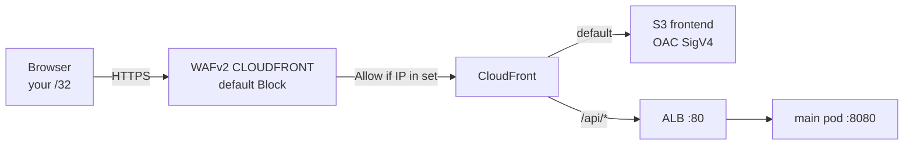

# CloudFront, S3 SPA bucket, and WAF

The public UI is **not** the Gateway ALB hostname. After `make cdn` it is `https://{distribution}.cloudfront.net` (example: `https://d2vrcfpvicsvlw.cloudfront.net`). Two CloudFormation stacks:

| Stack | Region | Template | Role |
|-------|--------|----------|------|
| `aws-project-dev-cdn-waf` | **us-east-1** (required for CloudFront-scope WAF) | `infra/62-cdn/waf.yaml` | IPSet + Web ACL |
| `aws-project-dev-cdn` | eu-west-1 | `infra/62-cdn/frontend.yaml` | Private S3, OAC, distribution, ALB SG |

`make cdn` also Helm-attaches that ALB SG and runs `make cdn-sync`. Not part of `make all`.

This is **not** the artifacts bucket (`aws-project-dev-artifacts-…`). Artifacts hold Helm charts and Lambda zips; the frontend bucket holds only `app/main/web`.

Network lock-down at the ALB is in [security-groups.md](security-groups.md). IAM for OAC (bucket policy, not a role) is in [iam-and-access.md](iam-and-access.md).

---

## Request path



Viewer always uses **HTTPS**. CloudFront talks to S3 with signed HTTPS (OAC). CloudFront talks to the ALB with **HTTP** (`OriginProtocolPolicy: http-only`) so the browser never hits mixed content: the page and `/api` share the CloudFront origin.

There are **no** CloudFront custom error responses. A 403/404 from `/api/*` stays JSON/status, not `index.html`.

---

## S3 frontend bucket

**Name:** `aws-project-dev-frontend-{account}-eu-west-1`  
**Template:** `FrontendBucket` in `infra/62-cdn/frontend.yaml`  
**Deletion:** `DeletionPolicy: Delete` / `UpdateReplacePolicy: Delete` (stack delete removes the bucket; objects must be gone first — `destroy-cdn` / empty via sync).

| Setting | Value | Why |
|---------|--------|-----|
| Block Public Access | All four **true**: `BlockPublicAcls`, `BlockPublicPolicy`, `IgnorePublicAcls`, `RestrictPublicBuckets` | No public ACL or public bucket policy can be attached |
| Object ownership | `BucketOwnerEnforced` | ACLs disabled |
| Encryption | SSE-S3 **AES256**, `BucketKeyEnabled` | Default encryption; no KMS |
| Static website hosting | **Off** | No website endpoint; CloudFront is the only reader |
| Versioning / lifecycle | **Not set** | Contrast the versioned artifacts bucket |
| Public access | **None** | No `Principal: *` GetObject |

Objects are uploaded by `make cdn-sync`:

```bash
aws s3 sync app/main/web s3://aws-project-dev-frontend-ACCOUNT-eu-west-1 \
  --delete --cache-control "max-age=60, must-revalidate"
aws cloudfront create-invalidation --distribution-id DIST --paths '/*'
```

`--delete` removes files that left `app/main/web`. Cache-Control on objects is 60s; CloudFront’s default behavior still uses the managed **CachingOptimized** policy (see below), so UI republish always invalidates `/*`.

### Bucket policy (`FrontendBucketPolicy`)

| Sid | Effect | Principal | Action | Condition |
|-----|--------|-----------|--------|-----------|
| `AllowCloudFrontRead` | Allow | `cloudfront.amazonaws.com` | `s3:GetObject` on `bucket/*` | `AWS:SourceArn` = **this** distribution ARN |
| `DenyInsecureTransport` | Deny | `*` | `s3:*` on bucket and objects | `aws:SecureTransport` = false |

A different CloudFront distribution, the S3 console “Open”, or an anonymous URL all fail. Your IAM user can still read/write with S3 APIs if their identity policy allows it (deployer / `EKS-User` S3 `aws-project-dev-*`).

**Console:** S3 → bucket → **Permissions**: Block Public Access, Object Ownership, Bucket policy. **Properties**: encryption. There is no “Static website hosting” enabled.

**CLI:**

```bash
aws s3api get-public-access-block --bucket aws-project-dev-frontend-ACCOUNT-eu-west-1
aws s3api get-bucket-policy --bucket aws-project-dev-frontend-ACCOUNT-eu-west-1
aws s3api get-bucket-encryption --bucket aws-project-dev-frontend-ACCOUNT-eu-west-1
```

---

## Origin Access Control (OAC)

| | |
|--|--|
| **Resource** | `AWS::CloudFront::OriginAccessControl` name `aws-project-dev-frontend` |
| **Origin type** | `s3` |
| **Signing** | **always**, protocol **sigv4** |
| **Legacy OAI** | Not used. The S3 origin still has `S3OriginConfig.OriginAccessIdentity: ''` (required empty string when using OAC). |

CloudFront signs every origin GetObject. Combined with the bucket policy `SourceArn` condition, only this distribution can read objects as the CloudFront service principal.

**Console:** CloudFront → **Origin access** (or the distribution origin → Origin access control).  
**CLI:** `aws cloudfront get-distribution-config --id DIST --query DistributionConfig.Origins`

---

## CloudFront distribution

Attached Web ACL: ARN from the us-east-1 stack (`WebACLId` on the distribution).

| Distribution setting | Value |
|----------------------|--------|
| Default root object | `index.html` |
| HTTP version | http2 |
| IPv6 | **disabled** (WAF IP set is IPv4-only; AAAA would be blocked by default) |
| Price class | `PriceClass_100` (US, Canada, Europe) |
| Alternate domain / ACM | **None** — use the `*.cloudfront.net` name |
| Custom error pages | **None** |

### Origins

| Id | Domain | Protocol | Notes |
|----|--------|----------|--------|
| `s3-frontend` | bucket regional DNS | S3 + OAC | Default origin |
| `eks-alb` | Gateway ALB DNS (`aws-project-dev-gw-….elb.amazonaws.com`) | **HTTP only** port 80 | `OriginReadTimeout` / `OriginKeepaliveTimeout` **60s** (AgentCore live weather). SSL protocols listed but unused because origin is http-only. |

### Cache behaviors

| Path | Origin | Viewer protocol | Methods | Cache policy (managed id) | Origin request policy |
|------|--------|-----------------|---------|---------------------------|------------------------|
| Default (`*`) | `s3-frontend` | redirect-to-https | GET, HEAD | **CachingOptimized** `658327ea-f89d-4fab-a63d-7e88639e58f6` | (none) |
| `/api/*` | `eks-alb` | redirect-to-https | GET, HEAD, OPTIONS | **CachingDisabled** `4135ea2d-6df8-44a3-9df3-4b5a84be39ad` | **AllViewer** `b689b0a8-53d0-40ab-baf2-68738e2966ac` |

`/api/*` must not cache live weather. **AllViewer** forwards viewer headers, cookies, and query strings to the ALB (needed for the API; the SPA itself uses same-origin `/api/...` with no extra header scheme).

**Console:** CloudFront → Distributions → this dist → **Behaviors**, **Origins**, **Security** (WAF). Region selector does not apply; CloudFront is global.

**CLI:**

```bash
aws cloudformation list-exports --region eu-west-1 \
  --query "Exports[?starts_with(Name, 'aws-project-dev-Frontend')]"
aws cloudfront get-distribution --id DIST --query Distribution.DistributionConfig.WebACLId
```

---

## WAF (CloudFront scope)

**Template:** `infra/62-cdn/waf.yaml`  
**Must live in us-east-1.** Scope is `CLOUDFRONT`, not `REGIONAL`. A regional Web ACL cannot attach to this distribution.

| Resource | Name | What it does |
|----------|------|----------------|
| IP set | `aws-project-dev-frontend` | IPv4: `ClientCidr` (default **`81.199.0.0/16`**, or `CLIENT_CIDR` / `WAF_CLIENT_CIDR`) |
| Web ACL | `aws-project-dev-frontend` | Default **Block**. One rule. |

### Rules (exact)

1. **Default action:** `Block` (anyone not matched is denied, including the rest of the internet).
2. **Rule `allow-client-ip`**, priority **0**, action **Allow**, statement **IPSetReference** to that IP set.

There are **no** AWS Managed Rules (no Core Rule Set, anonymous IP list, rate limit, geo match). This WAF is only an IP allowlist. Visibility: sampled requests + CloudWatch metric `aws-project-dev-frontend` / `allow-client-ip`.

Override with `make cdn-waf CLIENT_CIDR=x.x.x.x/32` (or full `make cdn`). The IP set is the Web ACL’s only allow source; the ALB SG does **not** use this CIDR.

**Console:** AWS WAF → **Web ACLs**. Switch the console region to **Global (CloudFront)** — not eu-west-1. Open `aws-project-dev-frontend` → **Rules** (default Block + allow-client-ip) → associated AWS resources (the distribution). IP set: WAF → IP sets → same name, Global.

**CLI (region us-east-1, scope CLOUDFRONT):**

```bash
aws wafv2 list-web-acls --scope CLOUDFRONT --region us-east-1
aws wafv2 get-web-acl --scope CLOUDFRONT --region us-east-1 \
  --id WEBACL_ID --name aws-project-dev-frontend
aws wafv2 list-ip-sets --scope CLOUDFRONT --region us-east-1
```

Sampled blocked requests: WAF console → Web ACL → **Overview** / sampled requests, or CloudWatch metrics in us-east-1 for the ACL name.

---

## What each layer allows

| Layer | Allows | Blocks |
|-------|--------|--------|
| WAF | Your `CLIENT_CIDR` to **CloudFront** | Every other client IP to the distribution |
| S3 Block Public Access + policy | CloudFront OAC GetObject for **this** distribution | Public S3 URLs, other distributions |
| ALB SG | CloudFront **origin-facing** prefix list to `:80` | Your laptop and the rest of the internet to the ALB |
| CloudFront `/api/*` cache | Always origin (CachingDisabled) | Stale live weather at the edge |

A 403 from the CloudFront URL is usually WAF (wrong IP). A timeout or connection failure to the ALB DNS is usually the SG. An AccessDenied on the S3 website-style URL is expected.

---

## Makefile

| Target | Effect |
|--------|--------|
| `make cdn-waf` | Deploy/update the us-east-1 Web ACL + IP set (default `81.199.0.0/16`) |
| `make cdn-infra` | S3 + OAC + distribution + ALB SG (needs Gateway ALB + WAF export + prefix list) |
| `make cdn` | `alb` + `cdn-waf` + `cdn-infra` + Helm (attach SG) + `cdn-sync` |
| `make cdn-sync` | Sync `app/main/web` + invalidate `/*` |
| `make destroy-cdn` | Tear down CDN stacks (after emptying the bucket as the Makefile does) |
