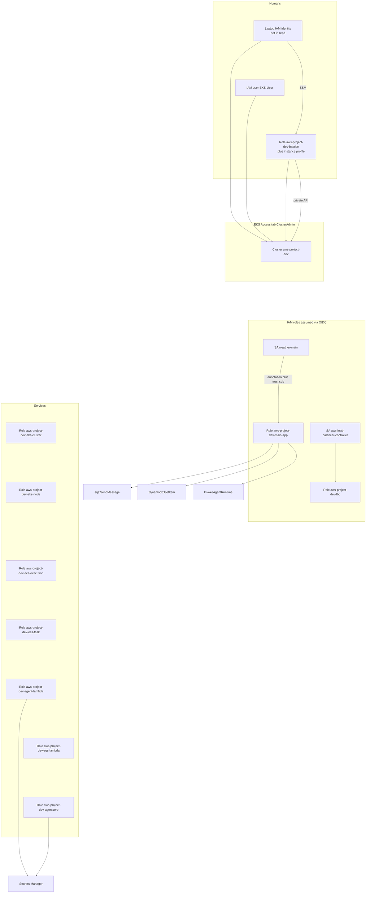

# IAM and access

All infrastructure IAM is defined in CloudFormation under `infra/`. Application pods on EKS use **IRSA** (IAM Roles for Service Accounts), not the node instance profile. Default names use `ProjectName=aws-project` and `Environment=dev`.

This project does **not** create IAM Identity Center (SSO) permission sets, and it does **not** create the identity you use on your laptop to run `make`. That caller is whoever `aws sts get-caller-identity` returns.

---

## How to look things up (console vs CLI)

IAM **Roles** and the **EKS-User** user show up in the IAM console. Several bindings **do not**:

| Binding | IAM console? | Where it actually is |
|---------|--------------|----------------------|
| Who may call the EKS API | No (except the role/user existing) | EKS → cluster `aws-project-dev` → **Access** tab |
| IRSA (pod → role) | Only the role’s **Trust relationships** JSON | Kubernetes ServiceAccount annotation + that trust policy |
| EC2 instance role | Role exists; assignment is the instance profile | EC2 instance → **Security** → IAM role |
| CloudFront reading S3 | No IAM role | S3 bucket → **Permissions** → bucket policy (principal `cloudfront.amazonaws.com` + `AWS:SourceArn`) |
| WAF IP allowlist | No | WAF & Shield → Web ACLs, region **Global (CloudFront)** |
| API Gateway private invoke | No IAM user | API Gateway → API → **Resource policy** (`aws:SourceVpce`) |

**CLI — who am I**

```bash
aws sts get-caller-identity
```

**CLI — project-prefixed roles**

```bash
aws iam list-roles --query "Roles[?starts_with(RoleName, 'aws-project-dev-')].RoleName" --output text
```

**CLI — EKS access entries (cluster RBAC for IAM principals)**

```bash
aws eks list-access-entries --cluster-name aws-project-dev --region eu-west-1
aws eks list-associated-access-policies --cluster-name aws-project-dev --region eu-west-1 \
  --principal-arn arn:aws:iam::ACCOUNT:role/aws-project-dev-bastion
```

**CLI — IRSA wiring for the main app**

```bash
# Trust policy (OIDC + serviceaccount:weather:weather-main)
aws iam get-role --role-name aws-project-dev-main-app --query AssumeRolePolicyDocument
# On the cluster (from the bastion)
kubectl get sa weather-main -n weather -o yaml
```

---

## Humans and operator principals

### Laptop deployer (not created by this repo)

- **What:** Your existing IAM user or SSO role. CloudFormation, ECR push, SSM to the bastion, and `make cdn` all use this identity.
- **EKS:** The cluster is created with `BootstrapClusterCreatorAdminPermissions: true` and `AuthenticationMode: API`. The **cluster creator** gets an EKS access entry with `AmazonEKSClusterAdminPolicy`. That principal is **not** listed in our YAML; it is whoever created stack `aws-project-dev-eks`.
- **Console:** IAM → Users or SSO → your user. EKS → **Access** to see the creator entry.
- **CLI:** `aws sts get-caller-identity` then `aws eks list-access-entries --cluster-name aws-project-dev`.

This identity cannot call the Kubernetes API from home: the EKS endpoint is **private**. Helm/`kubectl` run on the bastion via SSM.

### IAM user `EKS-User`

| | |
|--|--|
| **Template** | `infra/20-eks/cluster.yaml` → `EksUser` |
| **IAM name** | `EKS-User` (no project prefix) |
| **Login profile** | None in CloudFormation — **no AWS Console password**. Use access keys if you create them (also **not** in the template). |
| **IAM policy** | Inline `aws-project-dev-eks-user-aws-access` on the user: `eks:DescribeCluster`/`ListClusters`, ECR read on `aws-project-dev/*`, S3 on `aws-project-dev-*` buckets, Secrets Manager `aws-project/dev/*`, DynamoDB tables `aws-project-dev-*`, CloudWatch logs under `/aws/eks/aws-project-dev*`. |
| **EKS** | Access entry `Username: eks-user`, policy **AmazonEKSClusterAdminPolicy**, cluster scope. |

**Console:** IAM → Users → `EKS-User` → **Permissions** (inline AWS APIs) and **Security credentials** (keys). Cluster admin is **not** an IAM managed policy — EKS → Access → principal ARN of this user.

**CLI:**

```bash
aws iam get-user --user-name EKS-User
aws iam list-user-policies --user-name EKS-User
aws iam get-user-policy --user-name EKS-User --policy-name aws-project-dev-eks-user-aws-access
aws eks describe-access-entry --cluster-name aws-project-dev --region eu-west-1 \
  --principal-arn arn:aws:iam::ACCOUNT:user/EKS-User
```

Intended use: keys on a host **inside the VPC** plus `aws eks update-kubeconfig`. Not the day-to-day deploy path (`make` uses your laptop identity + bastion).

### Role `aws-project-dev-bastion` + instance profile

| | |
|--|--|
| **Template** | `infra/50-bastion/bastion.yaml` |
| **IAM** | Role `aws-project-dev-bastion`. Instance profile **same name**. Trust: `ec2.amazonaws.com`. |
| **AWS managed** | `AmazonSSMManagedInstanceCore` (Session Manager; no SSH). |
| **Inline `operator-access`** | `eks:DescribeCluster`, `eks:ListClusters`; ECS/SQS inspect + send/receive; `s3:GetObject`/`ListBucket` on the artifacts bucket only. |
| **Attached to** | Bastion EC2 via the instance profile. IMDS on the instance (hop limit default). |
| **EKS** | Access entry `Username: bastion`, **AmazonEKSClusterAdminPolicy**, when `GrantEksClusterAdmin=yes` (default). |

**Console:** IAM → Roles → `aws-project-dev-bastion`. EC2 → instance `aws-project-dev-bastion` → **Security** → IAM role. EKS → Access → role ARN.

**CLI:**

```bash
aws iam get-role --role-name aws-project-dev-bastion
aws ec2 describe-instances --filters Name=tag:Name,Values=aws-project-dev-bastion \
  --query 'Reservations[].Instances[].IamInstanceProfile'
aws ssm start-session --target i-xxxxxxxx   # make connect
```

Typical flow: laptop credentials → **SSM Run Command** / Session on this role → Helm and `kubectl` as EKS admin.

---

## EKS cluster and node roles (AWS services, not humans)

### Role `aws-project-dev-eks-cluster`

- **Trust:** `eks.amazonaws.com`
- **Managed:** `AmazonEKSClusterPolicy`
- **Attached to:** The EKS control plane (`EksCluster.RoleArn`), not to any EC2 instance you can SSH to.
- **Console:** IAM → Roles → `aws-project-dev-eks-cluster`. EKS → cluster → **Overview** shows the cluster role ARN.
- **CLI:** `aws iam get-role --role-name aws-project-dev-eks-cluster`

### Role `aws-project-dev-eks-node`

- **Trust:** `ec2.amazonaws.com`
- **Managed:** `AmazonEKSWorkerNodePolicy`, `AmazonEKS_CNI_Policy`, `AmazonEC2ContainerRegistryReadOnly`
- **Attached to:** Managed node group instances (`Nodegroup.NodeRole`). Launch template sets **IMDSv2 hop limit 1**, so **pods cannot use this role**.
- **Console:** IAM → Roles → `aws-project-dev-eks-node`. EC2 → a node named `aws-project-dev-eks-node` → IAM role.
- **CLI:** `aws eks describe-nodegroup --cluster-name aws-project-dev --nodegroup-name aws-project-dev-nodes-v2 --query nodegroup.nodeRole`

---

## IRSA roles (pods assume these)

OIDC provider: `infra/20-eks/cluster.yaml` → `EksOidcProvider` (thumbprint for the cluster issuer). Console: IAM → **Identity providers** → the EKS OIDC URL. CLI: `aws iam list-open-id-connect-providers`.

### Role `aws-project-dev-main-app`

| | |
|--|--|
| **Template** | `infra/40-lambda/functions.yaml` → `MainAppRole` |
| **Trust** | Federated OIDC. Condition `sub` = `system:serviceaccount:weather:weather-main` and `aud` = `sts.amazonaws.com`. |
| **Inline `enqueue-and-read-weather`** | `sqs:SendMessage` on the work queue; `dynamodb:GetItem` on the results table. |
| **Separate policy `aws-project-dev-invoke-agentcore`** | Attached by the **agentcore** stack onto this **same role**: `bedrock-agentcore:InvokeAgentRuntime` on the Tel Aviv runtime ARN (and `…/*`). |
| **Kubernetes** | ServiceAccount `weather-main` in namespace `weather`, annotation `eks.amazonaws.com/role-arn: arn:aws:iam::ACCOUNT:role/aws-project-dev-main-app` (Helm `serviceAccount.roleArn`, filled by `make charts-stage`). |

**Console:** IAM → Roles → `aws-project-dev-main-app` → **Trust relationships** (must mention `system:serviceaccount:weather:weather-main`) → **Permissions** (two customer policies). The ServiceAccount is **not** in IAM: EKS → cluster → you can use `kubectl`, not the IAM “attached entities” list.

**CLI:**

```bash
aws iam list-role-policies --role-name aws-project-dev-main-app
aws iam list-attached-role-policies --role-name aws-project-dev-main-app
# agentcore policy is an AWS::IAM::Policy on the role:
aws iam get-role-policy --role-name aws-project-dev-main-app --policy-name aws-project-dev-invoke-agentcore
```

### Role `aws-project-dev-lbc`

| | |
|--|--|
| **Template** | `infra/61-lbc/iam.yaml` |
| **Trust** | OIDC `sub` = `system:serviceaccount:kube-system:aws-load-balancer-controller` |
| **Permissions** | Customer managed policy **`aws-project-dev-lbc`** (LBC v3.5: ELB, EC2 SG create/authorize, tags, WAF associate, …). |
| **Kubernetes** | Helm release in `kube-system`; SA annotation `eks.amazonaws.com/role-arn`. |

**Console:** IAM → Roles → `aws-project-dev-lbc`. IAM → Policies → `aws-project-dev-lbc`. kubectl: `kubectl get sa aws-load-balancer-controller -n kube-system -o yaml`.

---

## ECS roles

Both from `infra/30-ecs/cluster.yaml`. Weather service (`infra/31-ecs/weather-service.yaml`) sets them on the task definition.

| IAM name | Trust | Permissions | Attached how |
|----------|-------|-------------|--------------|
| `aws-project-dev-ecs-execution` | `ecs-tasks.amazonaws.com` | AWS managed `AmazonECSTaskExecutionRolePolicy` (ECR pull, logs) | Task definition **execution** role |
| `aws-project-dev-ecs-task` | `ecs-tasks.amazonaws.com` | Inline `project-resource-access`: S3 `aws-project-dev-*`, Secrets Manager `aws-project/dev/*`, DynamoDB tables `aws-project-dev-*` | Task definition **task** role (runtime). The weather API today is HTTP+NAT only; the policy is for the cluster generally. |

**Console:** ECS → Clusters → `aws-project-dev-ecs` → service `weather` → **Task definition** → Execution role / Task role. IAM → those role names.

**CLI:** `aws ecs describe-task-definition --task-definition … --query taskDefinition.{exec:executionRoleArn,task:taskRoleArn}`

Tasks have **no public IP**; outbound internet is NAT, not an IAM “public” flag.

---

## Lambda roles

From `infra/40-lambda/functions.yaml`. Trust is always `lambda.amazonaws.com`. Each function also has `AWSLambdaBasicExecutionRole` + `AWSLambdaVPCAccessExecutionRole`.

| IAM name | Function | Extra policy |
|----------|----------|--------------|
| `aws-project-dev-agent-lambda` | Barcelona Strands agent | Inline `read-anthropic-secret` on secret `aws-project/dev/anthropic` |
| `aws-project-dev-sqs-lambda` | Bangkok/Tokyo worker | Inline `sqs-consume` (receive/delete on work queue) + `dynamodb:PutItem` on results table |
| `aws-project-dev-http-lambda` | Sample `/hello` | Managed only |

**Console:** Lambda → function → **Configuration → Permissions → Execution role**. IAM → role name.

**CLI:** `aws lambda get-function --function-name aws-project-dev-agent --query Configuration.Role`

---

## AgentCore role `aws-project-dev-agentcore`

| | |
|--|--|
| **Template** | `infra/41-agentcore/runtime.yaml` → `AgentCoreExecutionRole` |
| **Trust** | `bedrock-agentcore.amazonaws.com` with `aws:SourceAccount` and `aws:SourceArn` like `arn:…:bedrock-agentcore:eu-west-1:ACCOUNT:*` |
| **Inline `agentcore-runtime`** | ECR on repo `aws-project-dev/agentcore`, `ecr:GetAuthorizationToken`, CloudWatch Logs, X-Ray, `cloudwatch:PutMetricData` (namespace `bedrock-agentcore`), workload access tokens, read Anthropic secret |
| **Attached to** | AgentCore Runtime `RoleArn` (not a Lambda, not an EC2 instance) |

**Console:** IAM → Roles → `aws-project-dev-agentcore`. Bedrock / AgentCore → runtime → execution role. There is no “instance profile”.

**CLI:** `aws iam get-role --role-name aws-project-dev-agentcore`

Invoke rights for the **main app** are the extra policy on `aws-project-dev-main-app`, not on this role.

---

## Other IAM (no human login)

### VPC flow logs role

- **Template:** `infra/10-network/vpc.yaml` → `FlowLogRole` (**no** fixed `RoleName`; CloudFormation generates `aws-project-dev-network-FlowLogRole-…`).
- **Trust:** `vpc-flow-logs.amazonaws.com` with source account/ARN conditions.
- **Policy:** `logs:CreateLogStream` / `PutLogEvents` / `DescribeLogStreams` on `/aws/vpc/aws-project-dev/flowlogs`.
- **Console:** CloudFormation → stack `aws-project-dev-network` → **Resources** → `FlowLogRole`, or VPC → Your VPCs → **Flow logs**. IAM search `FlowLogRole`.
- **CLI:** `aws iam list-roles --query "Roles[?contains(RoleName, 'FlowLogRole')].[RoleName,Arn]"`

### CloudFront / S3 SPA (not a role)

No IAM role for the CDN. `cloudfront.amazonaws.com` is allowed `s3:GetObject` on `aws-project-dev-frontend-ACCOUNT-eu-west-1/*` when `AWS:SourceArn` is this distribution. Deny if `aws:SecureTransport` is false. Full bucket flags, OAC, cache behaviors, and WAF rules: [cdn-and-waf.md](cdn-and-waf.md).

**Console:** S3 → bucket → **Permissions → Bucket policy**. CloudFront → distribution → **Origins** → Origin access (OAC). IAM policy simulator will not show this as a role.

**CLI:** `aws s3api get-bucket-policy --bucket aws-project-dev-frontend-ACCOUNT-eu-west-1`

### Private API Gateway resource policy (not a role)

Allows `execute-api:Invoke` on `execute-api:/*` only when `aws:SourceVpce` is the execute-api endpoint. No public invoke URL.

**Console:** API Gateway → APIs → the private REST API → **Resource policy**.

---

## EKS access entries (cluster permission, not IAM policies)

`AccessConfig.AuthenticationMode: API` — no `aws-auth` ConfigMap as the source of truth.

| Principal | Access username | EKS access policy | Scope |
|-----------|-----------------|-------------------|--------|
| Cluster creator (laptop identity that deployed EKS) | (AWS-generated) | `AmazonEKSClusterAdminPolicy` | cluster |
| `arn:aws:iam::ACCOUNT:user/EKS-User` | `eks-user` | same | cluster |
| `arn:aws:iam::ACCOUNT:role/aws-project-dev-bastion` | `bastion` | same (if `GrantEksClusterAdmin=yes`) | cluster |

These policies live at `arn:aws:eks::aws:cluster-access-policy/AmazonEKSClusterAdminPolicy`. They **do not** appear under IAM → Policies for the user/role.

**Console:** EKS → Clusters → `aws-project-dev` → **Access**.

**CLI:**

```bash
aws eks list-access-entries --cluster-name aws-project-dev --region eu-west-1
aws eks list-associated-access-policies --cluster-name aws-project-dev --region eu-west-1 \
  --principal-arn PRINCIPAL_ARN
```

IRSA does **not** use access entries. The pod’s ServiceAccount token is exchanged with STS using the role trust policy.

---

## Secrets

| Secret | Storage | IAM consumers |
|--------|---------|---------------|
| Anthropic API key | Secrets Manager `aws-project/dev/anthropic` | `aws-project-dev-agent-lambda`, `aws-project-dev-agentcore` (and `EKS-User` / ECS task role have broader `aws-project/dev/*` read) |

Do not commit API keys; pass `ANTHROPIC_API_KEY=...` on `make lambda` when bootstrapping the secret.

**Console:** Secrets Manager → secret name. IAM does not list “who can read” until you inspect each role policy.

---

## Summary diagram



Network lock-down for the same resources is in [security-groups.md](security-groups.md).
