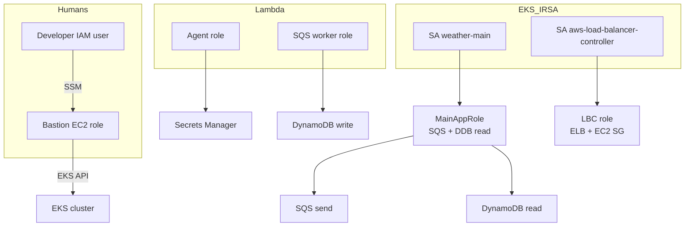

# IAM and access

All infrastructure IAM is defined in CloudFormation under `infra/`. Application pods on EKS use **IRSA** (IAM Roles for Service Accounts), not the node instance profile.

---

## Human / operator access

| Actor | Mechanism | Capability |
|-------|-----------|------------|
| **EKS-User** (IAM user in EKS stack) | Access keys + `aws eks update-kubeconfig` from **inside VPC** | EKS cluster admin (access entry + `AmazonEKSClusterAdminPolicy`) |
| **Bastion role** | EC2 instance profile | SSM; optional EKS access entry when `GrantEksClusterAdmin=yes` |
| **Developer PC** | AWS CLI credentials | CloudFormation deploy, ECR push, SSM to bastion — **not** direct EKS API (private) |

Typical flow: deploy from laptop → **SSM Run Command** on bastion for Helm → **SSM Session** for shells and port-forward.

---

## EKS IRSA roles

### Main app (`MainAppRole`)

- **Template:** `infra/40-lambda/functions.yaml`
- **Trust:** OIDC `sub` = `system:serviceaccount:weather:weather-main` (configurable params)
- **Permissions:**
  - `sqs:SendMessage` on work queue
  - `dynamodb:GetItem` on weather results table
- **Used by:** Helm `ServiceAccount` annotation `eks.amazonaws.com/role-arn`

Why IRSA exists: node IMDS hop limit is 1, so the Node app cannot use the worker node's IAM role for SQS/DynamoDB.

### AWS Load Balancer Controller (`{stack}-lbc`)

- **Template:** `infra/61-lbc/iam.yaml`
- **Trust:** `system:serviceaccount:kube-system:aws-load-balancer-controller`
- **Permissions:** AWS LBC v3.5 policy (ELB, EC2 SG, tags, etc.)
- **Used by:** LBC Helm service account

---

## ECS roles

From `infra/30-ecs/cluster.yaml`:

| Role | Purpose |
|------|---------|
| **Task execution role** | Pull image from ECR, write logs |
| **Task role** | Runtime AWS API access for weather task (minimal; weather service uses HTTP egress only) |

Weather Fargate tasks have **no public IP**; outbound internet via NAT for Open-Meteo.

---

## Lambda roles

From `infra/40-lambda/functions.yaml`:

| Role | Function | Notable permissions |
|------|----------|---------------------|
| **AgentLambdaRole** | HTTP agent | Logs, VPC ENI, Secrets Manager read (Anthropic secret) |
| **SqsLambdaRole** | SQS worker | Logs, VPC ENI, SQS poller, DynamoDB put on results table |
| **HttpLambdaRole** | Sample `/hello` API | Logs, VPC ENI |

Both weather Lambdas run in **app subnets** with the shared Lambda security group (egress all).

---

## EKS control plane and nodes

| Role | Purpose |
|------|---------|
| **Cluster role** | EKS service (`AmazonEKSClusterPolicy`) |
| **Node role** | Worker nodes: `AmazonEKSWorkerNodePolicy`, CNI, ECR read |

Nodes pull images and register with the cluster; **application** AWS calls use IRSA on pods.

---

## API Gateway private API policy

The REST API is **`PRIVATE`** and attached to the **execute-api VPC endpoint**. Resource policy allows `execute-api:Invoke` only when `aws:SourceVpce` matches that endpoint. There is **no** public invoke URL.

Main app pods resolve the standard `execute-api` DNS name to the **private endpoint** inside the VPC.

---

## Gateway ALB access control

Not IAM — **security group + LoadBalancerConfiguration**:

- `sourceRanges` on the Gateway LBC CRD (your public `/32` from `make alb` / `CLIENT_CIDR`)
- LBC creates/manages ALB SG rules for listener ports

---

## Secrets

| Secret | Storage | Consumers |
|--------|---------|-----------|
| Anthropic API key | Secrets Manager (optional CFN param on first deploy) | Agent Lambda |

Do not commit API keys; pass `ANTHROPIC_API_KEY=...` on `make lambda` when bootstrapping the secret.

---

## Summary diagram

