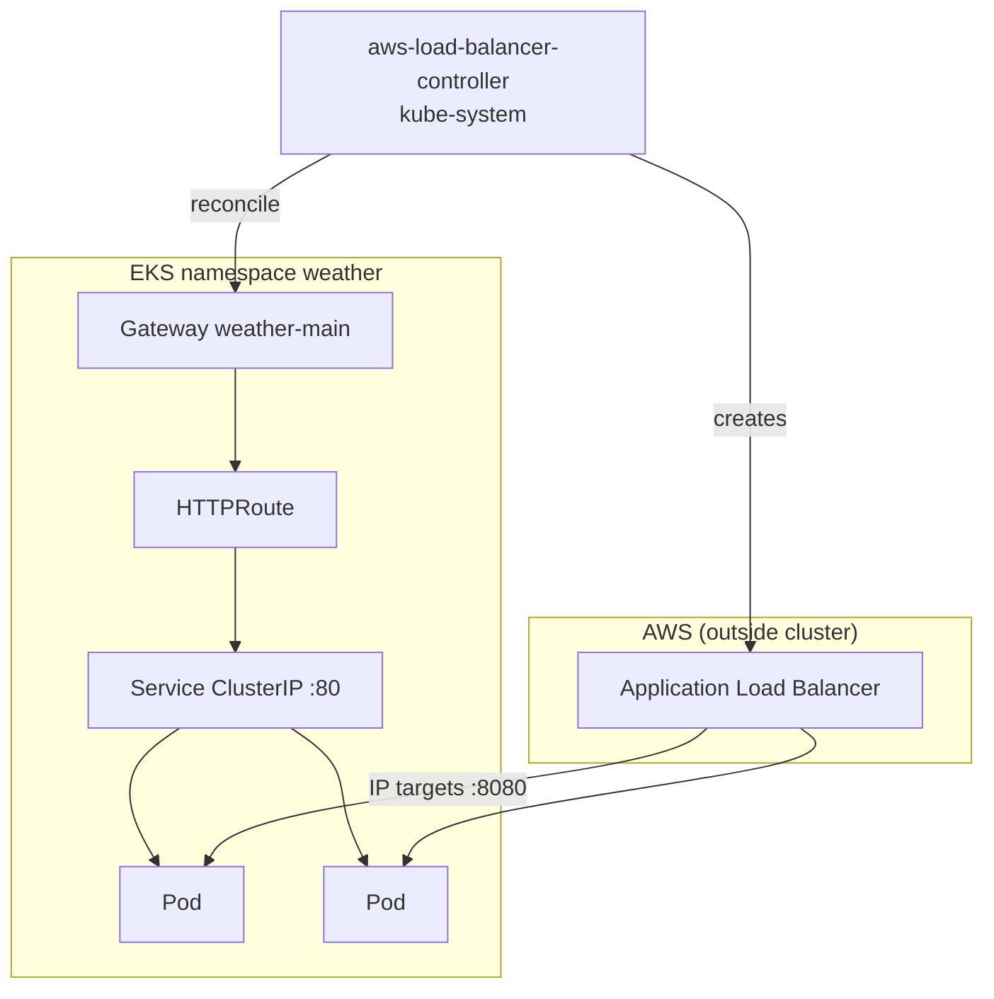

# Kubernetes and Gateway

---

## EKS cluster

Defined in `infra/20-eks/cluster.yaml`.

| Setting | Value |
|---------|--------|
| Name | `{ProjectName}-{Environment}` (e.g. `aws-project-dev`) |
| Version | 1.36 (parameter) |
| API endpoint | **Private only** (`EndpointPublicAccess: false`) |
| Worker subnets | All three **app** subnets |
| Nodes | Managed node group (default `t3.small`, desired 2, **min 2**) |
| Pod networking | Amazon VPC CNI (pod IPs from app subnet CIDRs) |

**IMDSv2** on nodes: `HttpPutResponseHopLimit: 1` so **pods cannot use the instance profile**. AWS API calls from application pods must use **IRSA**.

**OIDC provider** is created in the EKS stack for `AssumeRoleWithWebIdentity`.

---

## Main app workload

Helm chart: `deploy/charts/main/`.

| Resource | Name / notes |
|----------|----------------|
| Namespace | `weather` |
| Release | `weather-main` |
| Deployment | 2 replicas, **hard** topology spread (one pod per node and per AZ when possible); **PDB** `minAvailable: 1` |
| Service | **ClusterIP**, port 80 → container 8080 |
| ServiceAccount | IRSA → `MainAppRole` (SQS + DynamoDB) |
| Probes | `GET /healthz` |

Environment (from chart values / `make charts-stage`):

- `WEATHER_SERVICE_URL` — ECS Cloud Map base URL
- `AGENT_SERVICE_URL` — private API Gateway stage URL
- `WEATHER_QUEUE_URL`, `WEATHER_RESULTS_TABLE` — async cities
- `AWS_REGION`

Image: ECR `{account}.dkr.ecr.{region}.amazonaws.com/{stack}/main:{version}`.

---

## Gateway API and AWS Load Balancer Controller

Public HTTP is **not** `Service type: LoadBalancer`. It is:

1. **GatewayClass** — `controllerName: gateway.k8s.aws/alb`
2. **LoadBalancerConfiguration** — internet-facing ALB, `sourceRanges`, optional fixed name and subnet IDs
3. **TargetGroupConfiguration** — `targetType: ip`, health check `/healthz`
4. **Gateway** — listener HTTP :80
5. **HTTPRoute** — `/` → Service `weather-main:80`

Templates: `deploy/charts/main/templates/gateway.yaml` (rendered only when `gateway.sourceRange` is non-empty, set by `make alb` via `charts-stage`).

**Controller install** (`make lbc`):

1. `infra/61-lbc/iam.yaml` — IRSA role + LBC IAM policy
2. Chart pulled on dev machine, staged to S3 (bastion has no GitHub)
3. Bastion runs `bastion-lbc.sh`: Gateway API CRDs + Helm install in `kube-system`

Controller values highlights (`deploy/charts/aws-load-balancer-controller/values.yaml`):

- `enableServiceMutatorWebhook: false` — do not hijack `LoadBalancer` Services
- `defaultTargetType: ip` — aligns with Gateway target groups
- `featureGates.ALBGatewayAPI: true`
- IRSA annotation on service account; `clusterName`, `region`, `vpcId` filled at stage time

**Webhook**: EKS stack adds node SG ingress :9443 from cluster SG for the LBC validating/mutating webhook.

---

## Diagram: in-cluster vs ALB path

ClusterIP is still the HTTPRoute backend; the ALB target group points at **pod ENI IPs**, not the Service ClusterIP.

---

## Deploy mechanics

| Command | Effect |
|---------|--------|
| `make charts-version` | Sync chart version + image tag from `app/main/.version`; refresh URLs/roles from CFN exports |
| `make charts-stage` | `aws s3 sync deploy/charts` → artifacts bucket |
| `make app-helm` | SSM on bastion → `bastion-deploy.sh` → `helm upgrade --install` |
| `make app-deploy` | `app-push` + `charts-stage` + `app-helm` |
| `make app-forward` | SSM: `bastion-port-forward.sh` then tunnel to bastion loopback |

After upgrade, `bastion-deploy.sh` **rollout restart** so nodes pull the pinned tag if the deployment spec did not change.

---

## Optional / legacy

- **`infra/60-alb/alb.yaml`**: CloudFormation ALB targeting **NodePort** — superseded by Gateway; `make destroy-alb` removes it.
- **`make destroy-lbc`**: Deletes Gateway objects, uninstalls LBC Helm release, deletes LBC IAM stack (best-effort via bastion).
