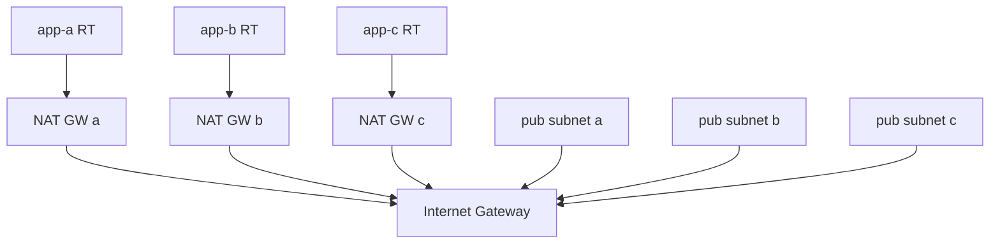
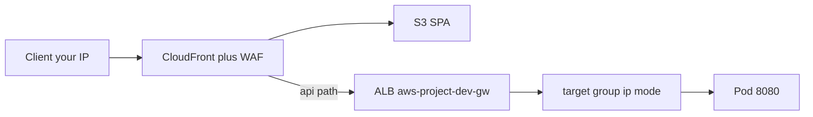

# Network and routing

The VPC is designed as a **private application network** with **controlled egress** and **no inbound internet** except what you explicitly add (NAT for outbound, Gateway ALB as the CloudFront API origin).

Default CIDR: **`10.0.0.0/16`** (`infra/10-network/vpc.yaml`).

---

## Subnet layout

For `10.0.0.0/16`, subnets are carved from fixed offsets:

| Tier | CIDR blocks (×3 AZs) | Use |
|------|----------------------|-----|
| **App** | `10.0.0.0/19`, `10.0.32.0/19`, `10.0.64.0/19` | EKS nodes/pods, ECS tasks, Lambda ENIs, bastion |
| **Data** | `10.0.96.0/24` … `10.0.98.0/24` | Reserved for data-tier workloads (egress-free route table) |
| **Endpoints** | `10.0.100.0/24` … `10.0.102.0/24` | Interface VPC endpoint ENIs |
| **Public (NAT stack)** | `10.0.104.0/24` (a), `10.0.105.0/24` (b), `10.0.106.0/24` (c) | NAT gateway, internet-facing ALB subnets |

App subnets are tagged:

- `kubernetes.io/role/internal-elb=1` — internal load balancers (if used)
- `kubernetes.io/cluster/{cluster-name}=shared` — cluster ownership for LBC/EKS

Public subnets (NAT stack) are tagged:

- `kubernetes.io/role/elb=1` — internet-facing ALBs (Gateway)
- Same cluster shared tag

---

## Route tables

**Before `make nat`:** app route tables have **no default route** to the internet. Workloads reach AWS APIs via **VPC endpoints** only.

**After `make nat`:** each app route table uses the **NAT Gateway in the same AZ** (`AppRouteNatA/B/C` → `NatGateway` / `NatGatewayB` / `NatGatewayC` in `infra/10-network/nat.yaml`). Loss of one AZ does not force all private egress through a NAT in a failed zone. That enables:

- ECS Fargate and Lambda to call **Open-Meteo** and **Anthropic** on the public internet
- EKS nodes to pull images if not fully covered by ECR endpoints (layers still use **S3 gateway** endpoint)
- AWS Load Balancer Controller to manage ALBs (also uses `elasticloadbalancing` VPC endpoint where configured)

**Isolated route table** (data + endpoint subnets): no NAT route — intended to stay without direct internet egress.

---

## VPC endpoints

`infra/10-network/endpoints.yaml` attaches endpoints so private workloads can use AWS APIs without traversing the public internet.

**Gateway endpoints (no hourly ENI charge):**

- **S3** — on all route tables (ECR layer storage)
- **DynamoDB** — on all route tables (weather results table for SQS flow)

**Interface endpoints (HTTPS :443 from VPC CIDR):**

| Service | Why it matters |
|---------|----------------|
| SSM, ssmmessages, ec2messages | Bastion access without SSH |
| ecr.api, ecr.dkr | Pull container images |
| logs | CloudWatch Logs |
| sts | IRSA and role chaining |
| ec2, autoscaling, eks | Node/cluster operations |
| elasticloadbalancing | LBC creates ALBs |
| ecs | ECS control plane |
| secretsmanager | Agent Lambda Anthropic secret |
| **execute-api** | **Private** API Gateway invoke URL from inside VPC |
| **bedrock-agentcore** | **InvokeAgentRuntime** from main app pods (Tel Aviv) |
| lambda | Lambda control plane |
| sqs | Main app sends messages (can also use NAT) |

`ENDPOINT_AZ` defaults to **`multi-az`** (one ENI per AZ). `single-az` places one ENI per endpoint type in the first endpoint subnet; DNS still resolves VPC-wide (cross-AZ traffic possible).

---

## Public access path (CloudFront + Gateway ALB)

Not part of the base VPC template. Activated by **`make nat`**, **`make alb`**, then **`make cdn`**.

- **S3**, **OAC**, **CloudFront cache behaviors**, and **WAF rule list** (default Block, allow `CLIENT_CIDR`): **[cdn-and-waf.md](cdn-and-waf.md)**.
- **ALB security group** (from `aws-project-dev-cdn`) allows TCP 80 only from the CloudFront origin-facing prefix list. Direct browser hits to the ALB are dropped.
- **LoadBalancerConfiguration** uses that SG as `securityGroups: ["sg-…"]` strings plus `manageBackendSecurityGroupRules: true` when `gateway.securityGroupId` is set (`make cdn` / `charts-stage`). Without CDN, `make alb` still uses `sourceRanges` for your `/32`.
- **TargetGroupConfiguration** (`targetType: ip`) registers **pod IPs** (port 8080). ALB subnets in every AZ where pods run.
- In-cluster Service type is **ClusterIP**.

Republish the SPA with `make cdn-sync` after UI changes (S3 sync + CloudFront invalidation). Helm/image deploy is still `make app-deploy` for API changes.

---

## DNS and service discovery

| Name | Resolves to | Consumers |
|------|-------------|-----------|
| `weather.{ProjectName}-{Environment}.local` | ECS task IPs (Cloud Map) | Main app pods (`WEATHER_SERVICE_URL`) |
| `{api-id}.execute-api.{region}.amazonaws.com` | Private API Gateway (via **execute-api** endpoint DNS) | Main app pods (`AGENT_SERVICE_URL`) |
| `bedrock-agentcore.{region}.amazonaws.com` | AgentCore data plane (via **bedrock-agentcore** endpoint) | Main app pods (`InvokeAgentRuntime`) |
| Kubernetes Service `weather-main.weather.svc` | ClusterIP | In-cluster only; HTTPRoute backend |

Cloud Map is **private DNS inside the VPC**; your laptop cannot resolve it without being in the VPC (use the CloudFront URL or `app-forward`).

---

## Security groups

High-level map: additional EKS cluster SG on the **control plane**, EKS-managed cluster SG on **nodes/pods**, bastion (egress only), ECS tasks (inbound from VPC CIDR), Lambda and AgentCore (egress only), interface endpoints (`:443` from VPC), Gateway ALB (TCP 80 from the CloudFront origin-facing prefix list after `make cdn`).

Full attachment, rules, LBC-created groups, and console/CLI lookup: **[security-groups.md](security-groups.md)**.

IAM principals for the same resources: **[iam-and-access.md](iam-and-access.md)**.

---

## Operator paths

| Goal | Path |
|------|------|
| Browse app from home | `make cdn` → CloudFront HTTPS URL (WAF = your `/32`; ALB only from CloudFront) |
| Direct ALB (pre-CDN only) | `make alb` → ALB HTTP DNS with `sourceRanges` |
| Browse app via bastion | `make app-forward` → SSM → bastion `kubectl port-forward` → ClusterIP |
| Shell on bastion | `make connect` (SSM) |
| kubectl / Helm | On bastion (kubeconfig via `aws eks update-kubeconfig`) |

See [iam-and-access.md](iam-and-access.md) for IRSA and EKS access entries, and [security-groups.md](security-groups.md) for ALB / node SG rules.
