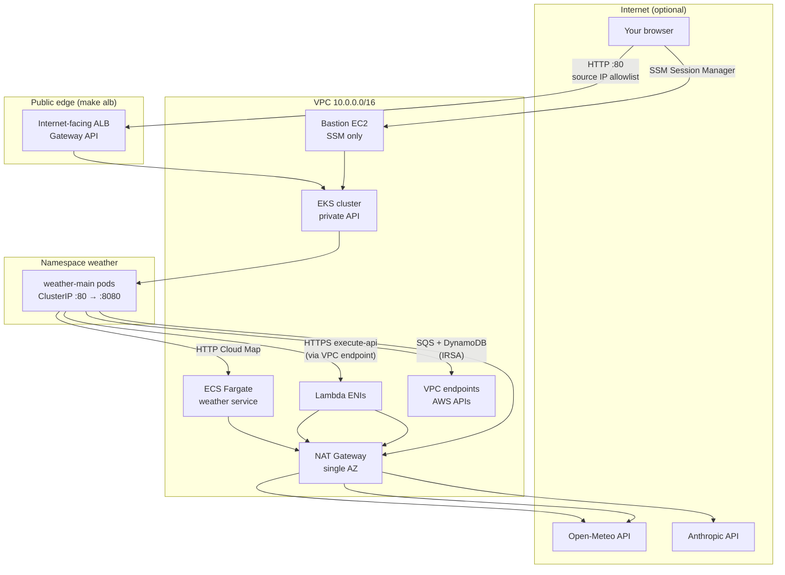
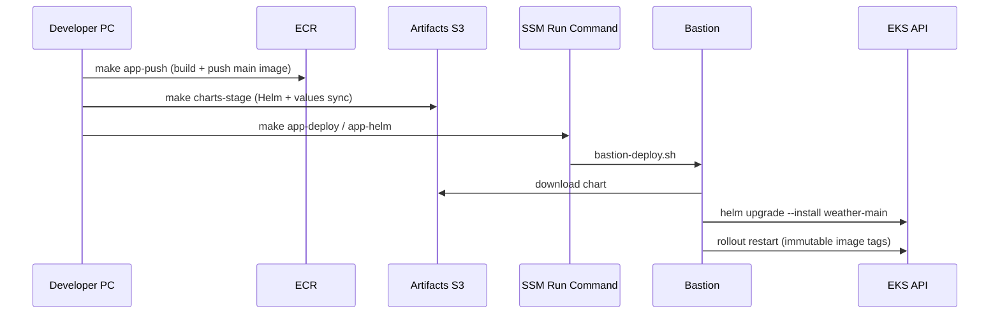

# Architecture overview

The Weather Board is a small Node.js web app on **Amazon EKS**. The UI shows several cities; each city’s **live** forecast is fetched through a different integration pattern on purpose: **ECS + Cloud Map**, **private API Gateway + agent Lambda**, and **SQS + worker Lambda + DynamoDB poll**.

Everything runs in a **private VPC** (`10.0.0.0/16`). There is no VPN and no public Kubernetes API. Operators reach the cluster through a **bastion** (SSM Session Manager). Optional **internet-facing access** to the app uses **Gateway API** and the **AWS Load Balancer Controller** (ALB → pod IPs), locked to your public IP via `make alb`.

---

## System context

---

## CloudFormation stacks (logical order)

Stacks are named `{ProjectName}-{Environment}-*` (default `aws-project-dev-*). Exports wire stacks together.

| Order | Makefile target | Stack / template | Role |
|------:|-------------------|------------------|------|
| 1 | `bootstrap` | `infra/00-bootstrap/artifacts.yaml` | S3 artifacts bucket (Helm charts, Lambda zips, bastion tools) |
| 2 | `registry` | `infra/15-registry/ecr.yaml` | ECR repos for `main` and `weather` images |
| 3 | `network` | `infra/10-network/vpc.yaml` | VPC, app/data/endpoint subnets, route tables (no IGW yet) |
| 4 | `endpoints` | `infra/10-network/endpoints.yaml` | S3/DynamoDB gateway + interface endpoints (SSM, ECR, EKS, …) |
| 5 | `eks` | `infra/20-eks/cluster.yaml` | Private EKS 1.36, node group, OIDC for IRSA |
| 6 | `ecs` | `infra/30-ecs/cluster.yaml` | ECS cluster + task roles |
| 7 | `ecs-weather` | `infra/31-ecs/weather-service.yaml` | Fargate weather API + Cloud Map |
| 8 | `lambda` | `infra/40-lambda/functions.yaml` | Agent + SQS Lambdas, private API Gateway, SQS, DynamoDB, **MainAppRole** (IRSA) |
| 9 | `bastion` | `infra/50-bastion/bastion.yaml` | SSM bastion, EKS access entry |

**Not in `make all` (opt-in):**

| Target | Template | Role |
|--------|----------|------|
| `nat` | `infra/10-network/nat.yaml` | IGW, NAT, public subnets for ALB (a/b/c), default route on app RTs |
| `lbc-iam` / `lbc` | `infra/61-lbc/iam.yaml` + Helm | IRSA for AWS Load Balancer Controller |
| `alb` | Helm (main chart Gateway) | Internet-facing ALB + Gateway/HTTPRoute; sets `gateway.sourceRange` |

Legacy **`infra/60-alb/alb.yaml`** (CloudFormation ALB + NodePort) is kept for teardown only; **Gateway** is the supported public path.

---

## Application components

| Path | Runtime | Purpose |
|------|---------|---------|
| `app/main/` | Docker → EKS | Weather Board UI + `/api/live/weather/{city}` router |
| `app/weather/` | Docker → ECS Fargate | Open-Meteo proxy for **New York** |
| `app/agent/` | Lambda (HTTP) | Strands + Claude Sonnet 4.5 for **Barcelona** |
| `app/sqs-weather/` | Lambda (SQS) | Open-Meteo for **Bangkok** / **Tokyo**; results via DynamoDB |

Helm chart: `deploy/charts/main/` (release `weather-main`, namespace `weather`).

---

## Deploy and release flow

- **Image tags** come from `app/main/.version` (not `latest` in cluster).
- **Chart values** pull CloudFormation exports (agent URL, SQS URL, DynamoDB table, MainApp IRSA ARN, Gateway subnets when staging for `alb`).
- **EKS API is private**; Helm and `kubectl` run on the bastion (or any host inside the VPC with credentials).

Public URL after `make alb`: Gateway status address (ALB DNS name), HTTP port 80.

Local dev tunnel without Gateway: `make app-forward` starts `kubectl port-forward` on the bastion, then SSM forwards `localhost:8080`.

---

## City → backend map

| City | Backend key | Integration |
|------|-------------|-------------|
| New York | `ecs` | HTTP to `http://weather.{stack}.local:8080/weather/new-york` |
| Barcelona | `agent` | GET `{AgentApiUrl}/weather/barcelona` (private API Gateway) |
| Bangkok, Tokyo | `sqs` | SQS message + poll DynamoDB by `requestId` |

Static placeholder data for all cities: `GET /api/weather` → bundled `web/data/weather.json`.

See [weather-backends.md](weather-backends.md) for step-by-step flows.

---

## Related docs

- [Network and routing](network-and-routing.md)
- [Kubernetes and Gateway](kubernetes-and-gateway.md)
- [Weather backends](weather-backends.md)
- [IAM and access](iam-and-access.md)
