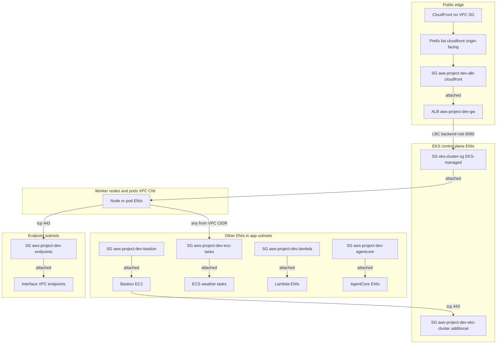

# Security groups

Names below are the default stack (`ProjectName=aws-project`, `Environment=dev`). CloudFormation does **not** set `GroupName`, so the EC2 group name is a generated suffix (`…-EndpointSecurityGroup-1ABC…`). Find groups by the **Name tag**.

Templates never leave AWS’s implicit “allow all IPv4 outbound” as the only story: every group we create sets **egress `IpProtocol: -1` to `0.0.0.0/0`**. Inbound is explicit; if a section says “no ingress”, the group has no inbound rules in the template (AWS still allows traffic that is a reply to an outbound flow because security groups are stateful).

---

## How to look them up

**Console (VPC, not IAM):** VPC → **Security Groups** (same list as EC2 → Security Groups) → search `aws-project-dev`. Open a group → **Inbound rules** / **Outbound rules** → **Associated resources** (or the ENI / instance / load balancer that lists this SG).

On a resource: EC2 instance → **Security** tab; EKS cluster → **Networking**; ECS service → **Network configuration**; Lambda → **Configuration → VPC**; ALB → **Security**; AgentCore runtime → **Network**.

**CLI (all project groups by Name tag prefix):**

```bash
aws ec2 describe-security-groups --region eu-west-1 \
  --filters Name=tag:Name,Values=aws-project-dev-* \
  --query 'SecurityGroups[].{Id:GroupId,NameTag:Tags[?Key==`Name`].Value|[0],Desc:Description}' \
  --output table
```

Rules for one group:

```bash
aws ec2 describe-security-groups --region eu-west-1 --group-ids sg-xxxxxxxx \
  --query 'SecurityGroups[].{In:IpPermissions,Out:IpPermissionsEgress}'
```

What is actually using it:

```bash
aws ec2 describe-network-interfaces --region eu-west-1 \
  --filters Name=group-id,Values=sg-xxxxxxxx \
  --query 'NetworkInterfaces[].{Id:NetworkInterfaceId,Desc:Description,Type:InterfaceType,IP:PrivateIpAddress}'
```

The AWS-managed EKS cluster SG is **not** tagged `aws-project-dev-*`. Use:

```bash
aws cloudformation list-exports --region eu-west-1 \
  --query "Exports[?contains(Name, 'aws-project-dev-Eks')].{Name:Name,Value:Value}"
```

| Export | What it is |
|--------|------------|
| `aws-project-dev-EksClusterSecurityGroupId` | Extra SG we attach to **control-plane ENIs** (`ClusterSecurityGroup` in `infra/20-eks/cluster.yaml`) |
| `aws-project-dev-EksNodeSecurityGroupId` | **EKS-created** cluster SG (`EksCluster.ClusterSecurityGroupId`), on **nodes** (and control plane) |

---

## Attachment map



CloudFront, S3, WAF, API Gateway, SQS, and DynamoDB are **not** in a VPC security group. Their lock-down is WAF, bucket policy / OAC, API Gateway resource policy, and IAM.

---

## Groups we create (CloudFormation)

### `aws-project-dev-eks-cluster` — additional cluster SG

| | |
|--|--|
| **Template** | `infra/20-eks/cluster.yaml` → `ClusterSecurityGroup` |
| **Attached to** | EKS **control-plane ENIs** only (`EksCluster.ResourcesVpcConfig.SecurityGroupIds`). **Not** on worker nodes. |
| **Inbound** | TCP **443** from VPC CIDR `10.0.0.0/16` (Kubernetes API). Extra rule from bastion stack: TCP **443** from `aws-project-dev-bastion`. |
| **Outbound** | All. |
| **Why** | Private API: nothing on the internet can hit the control plane. Anything in the VPC (nodes, bastion, pods) can. The bastion-sourced rule is redundant with the CIDR rule (bastion is in an app subnet) but makes the operator path obvious. |

Console: EKS → Clusters → `aws-project-dev` → **Networking** → **Additional security groups**.

---

### `eks-cluster-sg-aws-project-dev-*` — EKS-managed cluster SG

| | |
|--|--|
| **Template** | Created by EKS, not a `AWS::EC2::SecurityGroup` in the repo. Exported as `EksNodeSecurityGroupId`. |
| **Attached to** | Control-plane ENIs **and** managed node group instances (and therefore **pods**, because the VPC CNI reuses the node’s SGs unless you enable Security Groups for Pods — we do not). |
| **Inbound (EKS default)** | Traffic needed between the cluster and nodes (kubelet, control plane). Do not delete this group. |
| **Inbound (we add)** | TCP **9443** from the additional cluster SG (`ControllerWebhookFromControlPlane`) so the API server can reach the AWS Load Balancer Controller webhook pods. |
| **Inbound (LBC adds)** | After `make cdn`, LBC with `manageBackendSecurityGroupRules: true` authorizes **TCP 8080** from the ALB’s SG (`aws-project-dev-alb-cloudfront`) so IP-mode targets (pods) accept Gateway traffic. Before CDN, the same happens from the LBC-generated frontend SG. |
| **Outbound** | EKS default (typically all). |

Console: EKS → **Networking** → **Cluster security group**. Rules: VPC → that `sg-…` → Inbound. LBC-added rows show a description from the controller, not from our YAML.

CLI: `aws eks describe-cluster --name aws-project-dev --query cluster.resourcesVpcConfig`

---

### `aws-project-dev-bastion` — bastion EC2

| | |
|--|--|
| **Template** | `infra/50-bastion/bastion.yaml` → `BastionSecurityGroup` |
| **Attached to** | Bastion instance (`SecurityGroupIds`). One NIC in the first app subnet. |
| **Inbound** | **None.** No SSH, no 22. Session Manager does not need an inbound rule; the agent **egresses** to SSM VPC endpoints. |
| **Outbound** | All (so it can reach the EKS API, S3 gateway endpoint, SSM interface endpoints). |

---

### `aws-project-dev-endpoints` — interface VPC endpoints

| | |
|--|--|
| **Template** | `infra/10-network/endpoints.yaml` → `EndpointSecurityGroup` |
| **Attached to** | Every **interface** VPC endpoint ENI in this stack (SSM, ECR, EKS, `execute-api`, `bedrock-agentcore`, …). Gateway endpoints (S3, DynamoDB) have **no** SG. |
| **Inbound** | TCP **443** from VPC CIDR. |
| **Outbound** | All. |

If this group blocks 443, IRSA, `aws eks update-kubeconfig` on the bastion, private API Gateway, and AgentCore invoke all fail even though IAM is correct.

---

### `aws-project-dev-ecs-tasks` — Fargate weather tasks

| | |
|--|--|
| **Template** | `infra/30-ecs/cluster.yaml` → `TasksSecurityGroup` |
| **Attached to** | ECS service `weather` awsvpc ENIs (`infra/31-ecs/weather-service.yaml` `NetworkConfiguration.SecurityGroups`). App subnets, **no public IP**. |
| **Inbound** | **All protocols** from VPC CIDR. That is how main-app pods reach `weather.aws-project-dev.local:8080` (Cloud Map). |
| **Outbound** | All (NAT → Open-Meteo). |

---

### `aws-project-dev-lambda` — Lambda ENIs

| | |
|--|--|
| **Template** | `infra/40-lambda/functions.yaml` → `LambdaSecurityGroup` |
| **Attached to** | Agent, SQS-worker, and sample HTTP Lambda VPC configs (`SecurityGroupIds`). App subnets. |
| **Inbound** | **None.** Invoke is not a VPC TCP connection; API Gateway / SQS call the Lambda control plane. The ENI is for **outbound** (Secrets Manager, NAT → Anthropic / Open-Meteo). |
| **Outbound** | All. |

---

### `aws-project-dev-agentcore` — AgentCore Runtime ENIs

| | |
|--|--|
| **Template** | `infra/41-agentcore/runtime.yaml` → `AgentCoreSecurityGroup` |
| **Attached to** | AgentCore Runtime `NetworkModeConfig.SecurityGroups` (VPC mode, app subnets). |
| **Inbound** | **None.** `InvokeAgentRuntime` is an AWS API call (pods → `bedrock-agentcore` VPC endpoint). The runtime ENI is for egress (ECR, logs, secret, NAT → Anthropic / Open-Meteo). |
| **Outbound** | All. |

---

### `aws-project-dev-alb-cloudfront` — Gateway ALB (after `make cdn`)

| | |
|--|--|
| **Template** | `infra/62-cdn/frontend.yaml` → `AlbSecurityGroup` + `AlbFromCloudFront` |
| **Attached to** | Internet-facing ALB `aws-project-dev-gw`, because Helm `LoadBalancerConfiguration.spec.securityGroups` is that SG id (`gateway.securityGroupId` in `deploy/charts/main/values.yaml`). LBC **replaces** its auto-created frontend SG with this one. |
| **Inbound** | TCP **80** from managed prefix list `com.amazonaws.global.cloudfront.origin-facing` (`pl-4fa04526` in eu-west-1). **Not** your laptop `/32`. |
| **Outbound** | All (ALB health checks and traffic to pod IPs). |

Your browser never needs this SG. CloudFront’s **origin-facing** addresses do. WAF on the distribution is a separate control (who may call CloudFront), not an SG.

Console: EC2 → Load Balancers → `aws-project-dev-gw` → **Security**. Prefix-list rule: open the inbound rule and confirm **Source** is a `pl-…`, not `0.0.0.0/0`.

---

## Groups the AWS Load Balancer Controller creates

With **`make alb` only** (no CDN), Helm sets `sourceRanges` to your `/32`. LBC creates a **frontend** SG on the ALB (allow TCP 80 from that CIDR) plus backend rules on the node/cluster SG.

With **`make cdn`**, Helm sends `securityGroups: ["sg-…alb-cloudfront"]` as **strings** and `manageBackendSecurityGroupRules: true`. LBC:

1. Attaches the CDN SG to the ALB (no public `/32` on the ALB).
2. Ensures worker/pod SGs allow **8080** from that ALB SG (shared backend SG and/or a rule on `eks-cluster-sg-…`).

Those LBC groups are tagged with `elbv2.k8s.aws/cluster=aws-project-dev` and often a name like `k8s-traffic-…`. They are **not** in our YAML. Console: filter security groups by that tag. CLI:

```bash
aws ec2 describe-security-groups --region eu-west-1 \
  --filters Name=tag:elbv2.k8s.aws/cluster,Values=aws-project-dev
```

---

## Legacy (not the live public path)

`infra/60-alb/alb.yaml` (only for `make destroy-alb`) created `aws-project-dev-alb`: TCP 80 from `AllowedCidr`, plus NodePort on the EKS node SG from that ALB SG. Gateway + CloudFront superseded it.

---

## Traffic that is not a security group

| Path | Control |
|------|---------|
| Browser → CloudFront | WAF IP set (`infra/62-cdn/waf.yaml`, us-east-1, scope CLOUDFRONT) |
| CloudFront → S3 SPA | Bucket policy + OAC; all four S3 Block Public Access flags |
| Pod → SQS / DynamoDB | Gateway VPC endpoints + IRSA |
| Pod → private API Gateway | Interface `execute-api` endpoint SG + API resource policy (`aws:SourceVpce`) |
| Laptop → bastion | IAM + SSM; no SG inbound |
| Laptop → EKS API | Impossible from the internet (`EndpointPublicAccess: false`) |

See [iam-and-access.md](iam-and-access.md) for roles and [network-and-routing.md](network-and-routing.md) for subnets and prefix lists.
