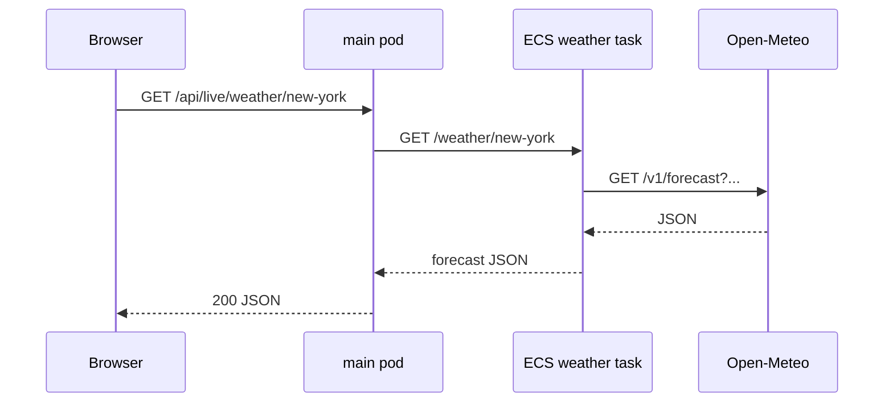
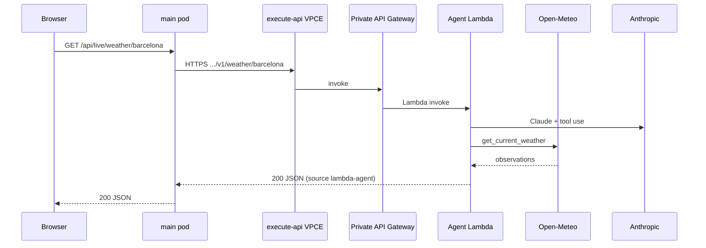
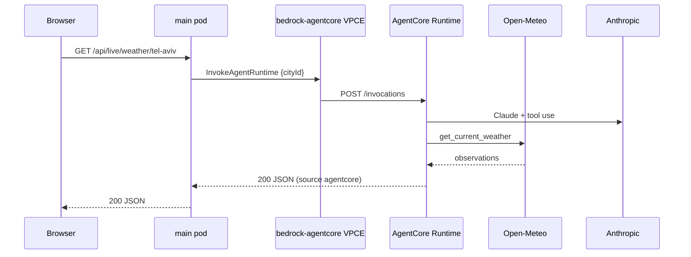
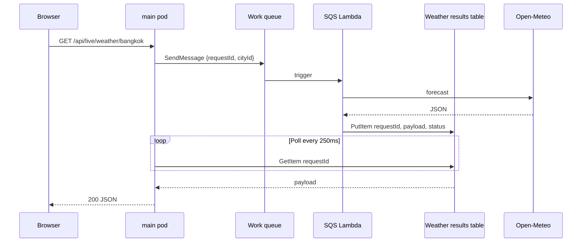

# Weather backends and application flows

The browser loads the SPA from **CloudFront** (`make cdn`). The city list is **static JSON** (`GET /data/weather.json` from S3). **Live** updates call `GET /api/live/weather/{cityId}` on the **same origin** (CloudFront proxies `/api/*` to the Gateway ALB). `make app-forward` is the same `/api` paths on `localhost:8080`; the catalog is `/data/weather.json` from the image. Routing is implemented in `app/main/server.js`; the UI maps cities in `app/main/web/app.js`.

---

## Backend routing table

| `cityId` | `CITY_BACKENDS` | Upstream |
|----------|-----------------|----------|
| `new-york` | `ecs` | ECS service `app/weather` |
| `barcelona` | `agent` | Lambda `app/agent` via API Gateway |
| `tel-aviv` | `agentcore` | AgentCore Runtime `app/agentcore` (Strands) |
| `bangkok`, `tokyo` | `sqs` | Lambda `app/sqs-weather` via SQS + DynamoDB |
| `london` | `static` | Bundled `web/data/weather.json` (UI does not call `/api/live`) |

`GET /api/live/weather/london` has no backend (`404`). The SPA reads London from the catalog.

---

## 1. New York — ECS (synchronous HTTP)

**ECS service** (`infra/31-ecs/weather-service.yaml`):

- Fargate task running `app/weather/server.js`
- Registered in Cloud Map as **`weather.{stack}.local:8080`**
- Task egress via NAT to **Open-Meteo**

**Main app** (`fetchLive` → `ecs`):

```http
GET {WEATHER_SERVICE_URL}/weather/new-york
```

Example base URL (from Helm): `http://weather.aws-project-dev.local:8080`.



**Weather ECS handler** maps WMO weather codes to UI `condition` / labels and returns the same JSON shape the board expects (`temperatureC`, `humidity`, etc.).

---

## 2. Barcelona — Agent Lambda (synchronous HTTP)

**Agent Lambda** (`app/agent/handler.py`):

- Invoked through **private REST API** (`infra/40-lambda/functions.yaml`)
- API type `PRIVATE`, bound to **execute-api VPC endpoint**
- Resource path: **`GET /weather/{city}`** → Lambda proxy integration
- Strands agent with **Anthropic Claude Sonnet 4.5**; tool `get_current_weather` calls Open-Meteo
- API key from env or **Secrets Manager** (`ANTHROPIC_SECRET_ARN`)

**Main app** (`fetchLive` → `agent`):

```http
GET {AGENT_SERVICE_URL}/weather/barcelona
```

`AGENT_SERVICE_URL` is the **stage root** (e.g. `https://{api-id}.execute-api.{region}.amazonaws.com/v1`) — no `/weather` in the env var; the code appends `/weather/{cityId}`.

Traffic stays in the VPC: pod → **execute-api endpoint** → API Gateway → Lambda ENI → NAT → Anthropic / Open-Meteo.



Response includes `source: "lambda-agent"` and `model` for display/debug.

---

## 3. Tel Aviv — AgentCore Runtime (synchronous SDK)

**AgentCore Runtime** (`infra/41-agentcore/runtime.yaml`, code in `app/agentcore/`):

- Strands agent with **Anthropic Claude Sonnet 4.5**; job instructions in `app/agentcore/skills/tel-aviv-weather/SKILL.md`
- Tool `get_current_weather` → Open-Meteo; same as Barcelona, hosted by **Amazon Bedrock AgentCore** (linux/arm64 container in ECR), not Lambda
- **VPC mode**: ENIs in app subnets; egress via NAT; secret from Secrets Manager
- Main app calls **`InvokeAgentRuntime`** (IRSA), payload `{ "cityId": "tel-aviv" }`
- HTTP contract inside the runtime is `POST /invocations` + `GET /ping` (AgentCore SDK)

**Main app** (`fetchLive` → `agentcore`):

Uses `AGENTCORE_RUNTIME_ARN` from Helm (`make charts-stage` fills `AgentCoreRuntimeArn`).



Response includes `source: "agentcore"` and `model`. Barcelona stays on Lambda.

---

## 4. Bangkok / Tokyo — SQS + DynamoDB (async poll)

SQS is **one-way**: the worker cannot HTTP callback to the main pod. Pattern:

1. Main app generates `requestId` (UUID), sends `{ requestId, cityId }` to **WorkQueue**
2. **SqsLambda** consumes the message, fetches Open-Meteo, writes result to **WeatherResultsTable** keyed by `requestId`
3. Main app **polls** DynamoDB (`ConsistentRead`) until `payload` appears or timeout (~20s)

**Main app** (`fetchViaSqs` in `server.js`):

- `SendMessage` → `WEATHER_QUEUE_URL`
- Loop: `GetItem` on `WEATHER_RESULTS_TABLE` / `requestId`
- `status: ok` → return forecast; `error` → 502 with body

**Worker** (`app/sqs-weather/handler.py`):

- Validates `cityId` ∈ { bangkok, tokyo }
- `put_item` with TTL (~300s) on the results table
- Partial batch failure reporting for SQS retries



**IAM**: Main app uses **IRSA** (`MainAppRole`): `sqs:SendMessage` on the work queue, `dynamodb:GetItem` on the results table. Worker role allows SQS consume + DynamoDB put + logs; egress via NAT for Open-Meteo.

---

## API surface (main app)

| Method | Path | Description |
|--------|------|-------------|
| GET | `/healthz` | Liveness/readiness (plain `ok`) |
| GET | `/api/weather` | Static board JSON |
| GET | `/api/live/weather/{cityId}` | Live backend per city |
| GET | `/*` | Static assets (`web/`) |

Frontend (`app.js`): **Try now** on a card calls `/api/live/weather/{id}` and shows toasts per `SOURCE_COPY` (ECS / agent / agentcore / sqs).

---

## Data shape

Live backends return JSON compatible with the static card renderer: `city`, `country`, `timezone`, `condition`, `conditionLabel`, `temperatureC`, `feelsLikeC`, `humidity`, `windKph`, optional `summary`, plus `source` (`open-meteo`, `lambda-agent`, `agentcore`, `sqs-lambda`, etc.).
